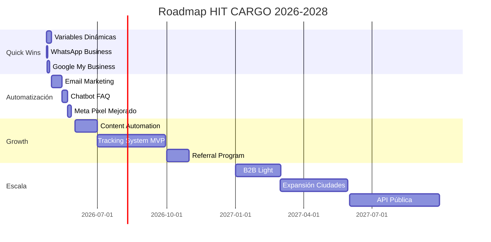

# 🚀 Plan Maestro HIT CARGO 2026-2028
## Automatización, Growth Hacking y Escalamiento para Negocio Familiar

> **Última actualización:** 23 de Abril, 2026
> **Equipo:** Renato (Dev), Maya (Diseño), Abi (Content)
> **Visión:** Convertir HIT CARGO en el líder de importaciones en Nicaragua mediante automatización inteligente

---

## 📋 CONTEXTO DEL NEGOCIO

### Equipo Actual (3 personas)
| Miembro | Rol Principal | Disponibilidad | Herramientas |
|---------|--------------|----------------|--------------|
| **Renato** | Developer | Tiempo parcial (trabajo principal aparte) | VSCode, Claude, GitHub |
| **Maya** | Diseñadora | En casa | Canva, Illustrator |
| **Abi** | Content Creator | Flexible | CapCut, Instagram, TikTok |

### Recursos Actuales
- **Budget publicitario:** Bajo (Meta Ads con presupuesto limitado)
- **Tiempo disponible:** 10-15 horas/semana entre todos
- **Ventaja competitiva:** Agilidad familiar + cero burocracia

### Situación Actual
- ✅ Website migrado a Astro (rápido y moderno)
- ✅ Seguridad implementada (0 vulnerabilidades)
- ⚠️ Sin automatización de procesos
- ⚠️ Respuestas manuales a todo
- ❌ Sin tracking automatizado
- ❌ Sin email marketing
- ❌ Sin presencia en Google

---

## 🎯 ROADMAP EJECUTIVO 2026-2028



---

## 🏃‍♂️ FASE 1: QUICK WINS INMEDIATOS
### Semana 1-2 | Sin inversión | ROI inmediato

### 1.1 Sistema de Variables Dinámicas ⚡
**Responsable:** Claude + Renato
**Tiempo:** 2 horas
**Impacto:** ALTO

#### ¿Qué es?
Un archivo único donde están TODOS los precios y configuraciones del negocio. Maya o Abi pueden cambiar precios sin tocar código.

#### Archivo: `business.config.ts`
```typescript
export const config = {
  // PRECIOS - Actualizar aquí cambia todo el sitio
  pricing: {
    air: {
      miami: {
        perPound: 5.50,     // ← Cambiar este número actualiza TODO
        transitDays: "5-7"
      },
      china: {
        perPound: 7.50,
        transitDays: "7-10"
      }
    },
    sea: {
      miami: {
        perCubicFoot: 8.50,
        transitDays: "20-25"
      }
    }
  },

  // PROMOCIONES - Activar/desactivar fácil
  promotions: {
    firstTimer: {
      active: true,        // ← true = mostrar, false = ocultar
      discount: 10,        // ← Porcentaje
      message: "10% OFF primera compra"
    }
  },

  // MÉTRICAS - Para mostrar social proof
  stats: {
    packagesDelivered: 15000,  // ← Actualizar mensualmente
    happyCustomers: 4500,
    yearsInBusiness: 8
  }
}
```

**Resultado:** Actualizar precios = editar 1 archivo, 0 programación

---

### 1.2 WhatsApp Business Automation 📱
**Responsable:** Abi
**Tiempo:** 30 minutos
**Impacto:** ALTO

#### Setup Express:
1. **Descargar** WhatsApp Business (gratis)
2. **Configurar perfil:**
   - Foto: Logo HIT CARGO
   - Descripción: "Importaciones desde USA, China y Panamá 🌎"
   - Horario: Lun-Vie 8am-6pm
3. **Catálogo** (3 servicios):
   - Envío Aéreo: "$5.50/lb desde Miami"
   - Envío Marítimo: "$8.50/ft³"
   - Consolidación: "Juntá y ahorrá"
4. **Mensajes automáticos:**
   ```
   Bienvenida: "¡Hola! 👋 Gracias por contactar HIT CARGO.
   Respondemos en menos de 1 hora. ¿En qué podemos ayudarte?"

   Fuera de horario: "Estamos fuera de horario 😴
   Te respondemos mañana a primera hora.
   Mientras, revisá precios en: hit-cargo.com"
   ```
5. **Quick Replies** para FAQs:
   - /precios → Tabla de precios
   - /rastrear → Link al tracking
   - /tiempo → Tiempos de entrega

**Resultado:** 50% menos tiempo respondiendo lo mismo

---

### 1.3 Google My Business 🗺️
**Responsable:** Renato + Maya
**Tiempo:** 1 hora
**Impacto:** MUY ALTO

#### Checklist:
- [ ] Ir a [business.google.com](https://business.google.com)
- [ ] Buscar "HIT CARGO Nicaragua"
- [ ] Crear/Reclamar perfil
- [ ] Completar info:
  ```
  Nombre: HIT CARGO Nicaragua
  Categoría: Freight Forwarding Service
  Teléfono: +505 8208-5181
  Website: https://hit-cargo.com
  Dirección: Carr Masaya Km 14.5, Residencial El Cortez B7
  Horario: L-V 8am-6pm, S 8am-1pm
  ```
- [ ] Subir 10 fotos (Maya):
  - Logo
  - Fachada
  - Oficina
  - Paquetes
  - Equipo
- [ ] Escribir descripción (150 palabras)
- [ ] Verificar por teléfono
- [ ] Configurar post semanal

**Resultado:** 1000+ vistas/mes GRATIS en Google

---

## 🤖 FASE 2: AUTOMATIZACIÓN BASE
### Mes 1-2 | Inversión: $0-50 | ROI: 300%

### 2.1 Email Marketing con Resend 📧
**Responsable:** Renato
**Tiempo:** 4 horas setup
**Costo:** GRATIS (3000 emails/mes)

#### Flujos Automáticos:
```
1. COTIZACIÓN INSTANTÁNEA
   Usuario llena calculadora → Email con precio → WhatsApp follow-up

2. ABANDONO DE COTIZACIÓN (3 días después)
   "Vimos que cotizaste un envío. ¿Necesitás ayuda?"

3. PRIMERA COMPRA
   "Bienvenido a la familia HIT CARGO + 10% descuento próximo envío"

4. CLIENTE FRECUENTE (5+ envíos)
   "Sos VIP: Tarifas especiales + Prioridad"
```

#### Templates Listos:
- Bienvenida
- Cotización detallada
- Tracking update
- Paquete en bodega
- Paquete entregado
- Solicitud de review
- Newsletter mensual

**Resultado:** 20% más conversión sin trabajo extra

---

### 2.2 Meta Pixel Optimizado 📊
**Responsable:** Renato
**Tiempo:** 2 horas
**Impacto:** CRÍTICO para ads

#### Eventos a trackear:
```javascript
// Eventos que mejoran los ads:
fbq('track', 'ViewContent', {
  content_name: 'Calculadora',
  content_category: 'Tools'
});

fbq('track', 'Lead', {
  value: 45.00,
  currency: 'USD',
  content_name: 'Cotización Miami'
});

fbq('track', 'InitiateCheckout', {
  value: calculatePrice(),
  num_items: 1
});

fbq('track', 'Purchase', {
  value: finalPrice,
  currency: 'USD'
});
```

#### Conversions API (Server-side):
- Más preciso que pixel solo
- Bypass de ad-blockers
- Mejor atribución

**Resultado:** 30% mejor ROI en ads sin gastar más

---

### 2.3 Chatbot para FAQ con Tidio 💬
**Responsable:** Abi + Renato
**Tiempo:** 3 horas setup
**Costo:** GRATIS (100 chats/mes)

#### Flujo del Bot:
```
VISITANTE LLEGA
    ↓
"¡Hola! Soy HIT Bot 🤖
¿En qué puedo ayudarte?"
    ↓
[Botones:]
→ Ver Precios
→ Rastrear Paquete
→ Tiempos de Envío
→ Hablar con Humano
    ↓
[Si elige Precios:]
"Aéreo desde Miami: $5.50/lb
Marítimo desde Miami: $8.50/ft³
¿Querés una cotización exacta?"
    ↓
[Captura email y peso]
    ↓
"Te enviamos la cotización a tu email.
Un asesor te contactará en 1 hora."
```

**Resultado:** Abi solo responde casos especiales

---

## 📱 FASE 3: CONTENT AUTOMATION
### Mes 2-4 | Maya + Abi protagonistas

### 3.1 Template System en Canva 🎨
**Responsable:** Maya
**Tiempo:** 1 día inicial, luego 5 min/post

#### Kit de Templates (30 diseños):
```
POSTS CUADRADOS (10):
- Precio del día
- Testimonio cliente
- Tip de importación
- Producto destacado
- Comparación precios
- FAQ visual
- Proceso paso a paso
- Métrica/Estadística
- Promoción
- Behind the scenes

STORIES (10):
- Unboxing
- Tracking update
- Quiz/Encuesta
- Countdown oferta
- Cliente feliz
- Tips rápidos
- Proceso en video
- Q&A
- Tour oficina
- Meme del día

REELS COVERS (10):
- Tutorial
- Testimonio
- Trend
- Educational
- Entertainment
```

**Colores de marca:**
```css
Primario: #FF6B35 (Naranja HIT)
Secundario: #2C3E50 (Azul oscuro)
Acento: #27AE60 (Verde éxito)
Neutro: #ECF0F1 (Gris claro)
```

**Resultado:** Post diario en 5 minutos

---

### 3.2 Content Calendar Automatizado 📅
**Responsable:** Abi
**Tool:** Later.com (GRATIS para 1 perfil)
**Tiempo:** 2 horas/mes para todo el contenido

#### Calendario Semanal:
| Día | Tipo | Tema | Red |
|-----|------|------|-----|
| **Lunes** | Educational | Tip de importación | IG/FB |
| **Martes** | Testimonial | Cliente feliz | Stories |
| **Miércoles** | Product | Servicio destacado | Feed |
| **Jueves** | Trend | Video viral adaptado | TikTok/Reels |
| **Viernes** | Promo | Oferta weekend | Todos |
| **Sábado** | UGC | Repost cliente | Stories |
| **Domingo** | Behind scenes | Team/Proceso | Stories |

#### Horarios Óptimos Nicaragua:
- **Morning:** 7-9 AM (antes del trabajo)
- **Lunch:** 12-1 PM (break almuerzo)
- **Evening:** 6-8 PM (después del trabajo)
- **Night:** 9-10 PM (scrolling nocturno)

**Resultado:** 1 día de trabajo = 1 mes de contenido

---

### 3.3 Video Scripts con AI 🎬
**Responsable:** Abi
**Herramienta:** ChatGPT/Claude
**Tiempo:** 10 minutos para 10 scripts

#### Prompts que Funcionan:
```
PARA HOOKS (primeros 3 segundos):
"Dame 10 hooks para TikTok sobre importar desde USA a Nicaragua.
Máximo 5 palabras cada uno. Que generen curiosidad."

PARA SCRIPTS COMPLETOS:
"Script de 30 segundos para Reel:
- Hook: problema de precios altos en Nicaragua
- Desarrollo: solución con HIT CARGO
- CTA: visitar link en bio
Tono: casual, nicaragüense, con humor"

PARA TRENDS:
"Cómo adaptar el trend [nombre del trend]
para empresa de importaciones.
Que sea gracioso pero profesional."
```

#### Fórmulas de Video que Funcionan:
1. **Antes/Después:** "POV: Comprando iPhone en Nicaragua vs USA"
2. **Tutorial:** "Cómo comprar en Amazon desde Nicaragua"
3. **Myth Busting:** "3 mitos sobre importar (que no son ciertos)"
4. **Day in Life:** "Un día en HIT CARGO"
5. **Customer Story:** "María ahorró $500 en su laptop"

**Resultado:** Nunca más página en blanco

---

## 🤖 FASE 4: TRACKING SYSTEM MVP
### Mes 3-6 | El diferenciador único

### 4.1 Versión Realista del Scraper 🔍
**Responsable:** Renato
**Tiempo:** 2-4 horas/semana
**Stack:** Simple y funcional

#### Timeline Ajustado:
```
MES 3 (Investigación):
Semana 1: Estudiar sistema Everest
Semana 2: Setup Cloudflare Workers
Semana 3: Prueba básica scraping
Semana 4: Diseño base de datos

MES 4 (Prototipo):
Semana 1-2: Scraper manual funcionando
Semana 3: Guardar en Supabase
Semana 4: API endpoint básico

MES 5 (Integración):
Semana 1-2: Mostrar en website
Semana 3: Sistema de cache
Semana 4: Notificaciones email

MES 6 (Pulido):
Semana 1: Testing completo
Semana 2: Dashboard interno
Semana 3: Documentación
Semana 4: Launch público
```

#### Arquitectura Simplificada:
```javascript
// En vez del sistema complejo original:
const trackingSystem = {
  scraper: "Cloudflare Worker cada 6 horas",
  database: "Supabase free (10k rows)",
  api: "2 endpoints en Hono",
  frontend: "Componente Preact simple",
  notifications: "Email cuando cambia status"
}

// Sin IA por ahora, solo regex:
const parseTracking = (html) => {
  const status = html.match(/Status: (.*?)</)[1];
  const location = html.match(/Location: (.*?)</)[1];
  return { status, location, timestamp: new Date() };
}
```

**Resultado:** Cliente ve su paquete real, competencia no lo tiene

---

## 💰 FASE 5: REVENUE OPTIMIZATION
### Mes 3-6 | Ganar más por cliente

### 5.1 Sistema de Upsells 📈
**Dónde:** En calculadora y checkout
**Implementación:** Componentes Preact

#### Upsells Automáticos:
```typescript
// En la calculadora:
const upsells = {
  insurance: {
    trigger: weight > 5,
    message: "Protegé tu envío con seguro por $X",
    price: value * 0.02
  },

  express: {
    trigger: true,
    message: "Llegá 2 días antes por $10 extra",
    price: 10
  },

  packaging: {
    trigger: fragile,
    message: "Empaque reforzado por $3",
    price: 3
  }
}
```

**Resultado:** +25% AOV sin esfuerzo de venta

---

### 5.2 Programa de Referidos 🎁
**Mecánica Simple:**

```
CLIENTE ACTUAL:
1. Recibe código único: "MARIA20"
2. Comparte con amigos
3. Amigo usa código = ambos ganan 10% OFF

TRACKING:
- UTM parameters en links
- Código en checkout
- Email automático con reward

REWARDS:
- 1 referido = 10% off
- 3 referidos = Envío gratis
- 5 referidos = VIP status
```

**Implementación:**
```javascript
// Generar código único:
const referralCode = `${firstName}${customerId}`;

// Track en URL:
const referralLink = `hit-cargo.com?ref=${referralCode}`;

// Aplicar descuento:
if (referralCode) {
  discount = 0.10;
  notifyReferrer(referralCode);
}
```

**Resultado:** 30% nuevos clientes vienen referidos

---

### 5.3 Programa de Puntos 🌟
**Simple pero efectivo:**

#### Mecánica:
- 1 punto por cada $1 gastado
- 100 puntos = $5 descuento
- Puntos expiran en 1 año

#### Niveles:
```
BRONCE (0-499 puntos):
- Puntos básicos
- Newsletter exclusivo

PLATA (500-1999 puntos):
- 1.2x puntos
- Prioridad soporte
- Early access ofertas

ORO (2000+ puntos):
- 1.5x puntos
- Envío gratis mensual
- Gerente de cuenta
- Tarifas especiales
```

**Resultado:** +40% repeat rate

---

## 🚀 FASE 6: ESCALA INTELIGENTE
### Mes 6-12 | Cuando estén listos

### 6.1 Expansión por Ciudades 🏙️
**Strategy:** Una ciudad a la vez

#### Roadmap:
```
Q3 2026: León
- Landing page: hit-cargo.com/leon
- Partner local para entregas
- Ads geo-targeted
- 1 influencer local

Q4 2026: Granada
- Replicar modelo León
- Ajustar según aprendizajes

Q1 2025: Matagalpa/Estelí
- Expansión norte del país

Q2 2025: Costa Caribe
- Bluefields/Puerto Cabezas
```

**Resultado:** +25% revenue por ciudad

---

### 6.2 B2B Light 💼
**Target:** Pequeños emprendedores

#### Oferta Simple:
```
PLAN EMPRENDEDOR (10+ envíos/mes):
- 15% descuento en tarifas
- Consolidación gratis
- Invoice mensual
- WhatsApp prioritario
- Dashboard básico

PLAN BUSINESS (25+ envíos/mes):
- 20% descuento
- Account manager
- API access
- Reportes mensuales
- Crédito 30 días
```

**Resultado:** 5-10 clientes B2B = 50% del revenue

---

## 📊 HERRAMIENTAS Y COSTOS

### Stack Completo (Mayoría Gratis)

| Categoría | Tool | Costo/mes | Alternativa Gratis |
|-----------|------|-----------|-------------------|
| **Analytics** | Google Analytics | $0 | - |
| **Email** | Resend | $0-20 | Brevo (300/día) |
| **Chat** | Tidio | $0-18 | Tawk.to |
| **Social** | Later | $0-15 | Creator Studio |
| **Design** | Canva | $0-12 | Canva Free |
| **Database** | Supabase | $0-25 | Firebase |
| **Hosting** | Cloudflare | $0-20 | Netlify |
| **SMS** | Twilio | $10-30 | WhatsApp |
| **CRM** | Notion | $0-8 | Google Sheets |

**Total mínimo:** $0-30/mes
**Total óptimo:** $50-100/mes
**ROI esperado:** 10x

---

## 📈 KPIs Y MÉTRICAS

### Métricas Principales (Revisar Mensual)

| Métrica | Actual | 3 Meses | 6 Meses | 12 Meses |
|---------|--------|---------|---------|----------|
| **Visitantes/mes** | 500 | 1,500 | 3,000 | 6,000 |
| **Conversión** | 2% | 4% | 6% | 8% |
| **Clientes/mes** | 10 | 60 | 180 | 480 |
| **Ticket promedio** | $45 | $55 | $65 | $75 |
| **Recurrencia** | 20% | 30% | 40% | 50% |
| **CAC** | $15 | $10 | $7 | $5 |
| **LTV** | $90 | $165 | $260 | $375 |
| **Revenue/mes** | $450 | $3,300 | $11,700 | $36,000 |

### Métricas Secundarias (Revisar Semanal)
- WhatsApp mensajes/día
- Google reviews nuevos
- Social engagement rate
- Email open rate (meta: 25%)
- Tiempo respuesta (meta: <1hr)
- Calculadora usage (meta: 40%)

---

## 🎬 PLAN DE ACCIÓN INMEDIATA

### ✅ ESTA SEMANA (24-30 Abril)

#### Día 1-2 (Renato - 4 hrs)
- [ ] Implementar variables dinámicas
- [ ] Crear calculadora precios
- [ ] Agregar Schema Markup
- [ ] Configurar Meta Pixel

#### Día 2-3 (Abi - 2 hrs)
- [ ] Setup WhatsApp Business
- [ ] Crear catálogo servicios
- [ ] Mensajes automáticos
- [ ] Quick replies FAQ

#### Día 3-4 (Maya - 2 hrs)
- [ ] 10 fotos del negocio
- [ ] 5 templates Canva
- [ ] Logo alta resolución
- [ ] Paleta de colores

#### Día 4-5 (Todos - 1 hr)
- [ ] Google My Business
- [ ] Solicitar 5 reviews
- [ ] Primer post GMB
- [ ] Compartir en redes

---

### 📅 PRÓXIMAS 4 SEMANAS

**Semana 2 (1-7 Mayo)**
- Email automation setup
- Chatbot FAQ básico
- 10 posts programados
- Blog primer artículo

**Semana 3 (8-14 Mayo)**
- Testimonios en video
- Landing page León
- Referral system design
- Analytics profundo

**Semana 4 (15-21 Mayo)**
- Upsells en calculadora
- Newsletter inaugural
- Partner meeting León
- Review progreso

**Semana 5 (22-28 Mayo)**
- Tracking system research
- Content batch creation
- B2B pitch deck
- KPIs primer reporte

---

## 🚨 REGLAS ANTI-BURNOUT

### Para Renato (Developer)
```javascript
const renatosRules = {
  maxHoursPerWeek: 4,
  noWorkAfter: "9:00 PM",
  featuresAtOnce: 1,
  promiseDeadlines: false,
  askForHelp: true
}
```

### Para Maya (Diseñadora)
```css
.mayas-rules {
  batch-creation: always;
  templates-over-custom: true;
  perfection-required: false;
  done-better-than-perfect: true;
  recycle-content: encouraged;
}
```

### Para Abi (Content)
```yaml
abis_rules:
  - record_all_content_one_day: true
  - reuse_what_works: always
  - networks_to_manage: 2_max
  - respond_messages: 2x_daily
  - trends_over_original: ok
```

---

## 💡 FILOSOFÍA DEL PLAN

### Principios Core:
1. **Familia > Negocio** - El trabajo se adapta a la vida
2. **Progress > Perfection** - Mejor hecho que perfecto
3. **Automate > Delegate** - Máquinas trabajan 24/7
4. **Test > Assume** - Data beats opiniones
5. **Consistency > Intensity** - Tortuga gana a liebre

### Mindset Ganador:
- No todo tiene que ser YA
- Pequeños pasos diarios > maratones
- Cada automatización = inversión
- Celebrar small wins
- Pedir ayuda es fortaleza

---

## 🎯 VISIÓN 2028

### Dónde estarán en 2 años:
```
HIT CARGO 2028:
- 500+ clientes recurrentes
- $50k+/mes en revenue
- 70% procesos automatizados
- Presencia en 5 ciudades
- 10+ empleados
- Sistema tracking con IA
- App móvil propia
- B2B 40% del negocio
- #1 en Google Nicaragua
- Caso de éxito nacional
```

### Pero más importante:
- Renato: Más tiempo para familia y proyectos
- Maya: Diseñando estrategia, no posts diarios
- Abi: Creando contenido premium, no respondiendo DMs
- Familia: Creciendo sin sacrificar vida personal

---

## 📞 SIGUIENTE PASO

### Opciones:

**A) Empezar con Quick Wins**
- Variables dinámicas HOY
- WhatsApp Business HOY
- Google My Business MAÑANA

**B) Planificar Reunión Equipo**
- Revisar plan juntos
- Asignar responsabilidades
- Definir primer sprint

**C) Profundizar en Área Específica**
- ¿Qué parte les interesa más?
- ¿Dónde necesitan más detalle?
- ¿Qué blockers ven?

---

## 📎 ANEXOS Y RECURSOS

### Links Útiles:
- [Google My Business](https://business.google.com)
- [WhatsApp Business](https://business.whatsapp.com)
- [Canva Templates](https://canva.com/templates)
- [Later.com](https://later.com)
- [Tidio Chat](https://tidio.com)
- [Resend Email](https://resend.com)

### Documentos Relacionados:
- [SEO Audit Completo](../COPY_SEO_AUDIT.md)
- [Master Plan Técnico 2025](../master-plan-2025.md)
- [Everest Scraper Plan](../everest-scraper-plan.md)

### Contacto Soporte:
- **Technical:** Renato (VSCode + Claude)
- **Design:** Maya (Canva)
- **Content:** Abi (CapCut)

---

*"El mejor momento para plantar un árbol fue hace 20 años. El segundo mejor momento es ahora."* 🌳

**¿Listos para empezar? ¡Hagamos HIT CARGO grande! 🚀**