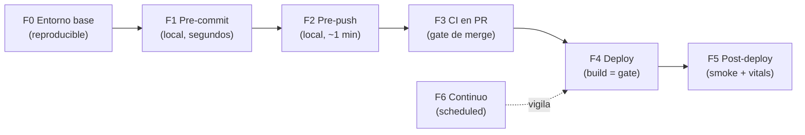

# Delivery harness — gates de calidad antes, durante y después del deploy

> Diseño portable. La primera mitad es genérica (principios + fases) y sirve de plantilla para cualquier repo del workspace `hit` (`hit-ever2`, `scraper-service`, futuros). La segunda mitad ([Apéndice A](#apéndice-a--estado-en-hit-cargo-web-v-12)) aterriza el estado concreto de `hit-cargo-web-v-1.2`.
> Contexto: [audit-2026-06.md](audit-2026-06.md) explica por qué hace falta. [../guides/ai-agent-workflow.md](../guides/ai-agent-workflow.md) explica cómo trabajan los agentes IA *dentro* de este harness.

## Principio rector

Un harness es el conjunto de **gates automáticos** que una entrega debe atravesar. La idea central, y la razón de existir de este documento:

> La confianza vive en el gate, no en la persona ni en el modelo.

Da igual si un cambio lo escribió Renato, un colaborador nuevo o un agente IA: pasa por los mismos checks o no llega a producción. Esto desacopla la calidad del rendimiento de cualquier individuo o LLM en un día dado. El modelo (o la persona) *produce*; el harness *verifica*. Si el harness es bueno, no necesitas confiar en quién produjo el cambio —solo en que el gate está verde.

Tres propiedades que un harness debe cumplir:

- **Determinista**: mismo input, mismo veredicto. Nada de "a veces pasa".
- **No evitable**: la protección de rama hace que el gate no se pueda saltar, ni con prisa ni con permisos.
- **Rápido donde importa**: barato y local primero (fail fast), caro y completo después. Si el gate tarda 20 min, nadie lo corre localmente y pierde su valor de fail-fast.

## Las fases



### F0 — Entorno base (fundamento)

Sin reproducibilidad, ningún gate posterior significa nada. Antes de cualquier check:

- Versión de Node pinneada (`.nvmrc` o `volta` en `package.json`) y honrada en CI.
- Gestor de paquetes pinneado (`packageManager` en `package.json`) e instalación con lockfile congelado (`pnpm install --frozen-lockfile`).
- `.env.example` que documenta toda variable que el código lee. El build falla si falta una variable requerida, no produce un sitio roto en silencio.

### F1 — Pre-commit (local, segundos)

Git hook sobre archivos staged. Barato e inmediato; corre solo lo que cambió.

- Format check (Prettier).
- Lint (ESLint) sobre staged.
- Typecheck incremental si es viable.

Objetivo: que nunca entre al historial un archivo mal formateado o con lint roto. Si tarda más de ~3 s, mover lo lento a F2.

### F2 — Pre-push (local, ~1 min)

Git hook pre-push, o el primer paso de CI si se prefiere no penalizar el push.

- Typecheck del proyecto completo.
- Suite de tests unitarios.
- Build (detecta errores que el dev server no ve).

Objetivo: no empujar una rama que romperá CI. Atrapa lo que el check de solo-staged no vio.

### F3 — CI en PR (el gate de merge)

El gate principal. Corre en GitHub Actions sobre cada PR. **La rama `master` está protegida: no se mergea sin CI verde + 1 review.**

- `pnpm install --frozen-lockfile`
- Lint + typecheck (proyecto completo)
- Tests + umbral de cobertura (la cobertura no puede bajar respecto a la base)
- Build
- Presupuesto de bundle (falla si JS/CSS gzip supera el límite de CLAUDE.md)
- Lighthouse CI contra la preview de Cloudflare Pages (perf/a11y/SEO/best-practices con mínimos)
- Validación de CSP y headers sobre la preview (los headers esperados llegan)
- Link check de enlaces internos

Esto es el "antes" del deploy: el cambio se prueba contra el preview deploy *antes* de tocar producción.

### F4 — Deploy (el build es un gate)

Merge a `master` dispara el auto-build de Cloudflare Pages. El build que falla no promociona. Es el "durante". Como F3 ya validó sobre la preview, F4 debería ser anticlimático —y así se quiere.

### F5 — Post-deploy (después)

Lo que F3 no puede ver: que **producción** quedó sana. Corre contra la URL de prod tras la promoción.

- Smoke test: rutas clave responden 200 (`/`, `/track`).
- Headers de seguridad presentes en prod (CSP, HSTS, X-Frame).
- JSON-LD parsea y valida.
- GTM carga y, cuando exista la capa de eventos, dispara.
- Core Web Vitals reales sobre prod (Lighthouse o synthetic).
- Plan de rollback escrito: en Cloudflare Pages, *Rollback to this deployment* sobre el último deploy verde. Documentar a quién avisar.

### F6 — Continuo (programado)

No atado a un deploy; vigila la deriva.

- Lighthouse semanal sobre prod (detecta regresiones de performance por contenido/datos).
- Auditoría de dependencias (`pnpm audit`, Dependabot/Renovate).
- Monitor de uptime (synthetic ping).
- Ritual quincenal de métricas del plan maestro (tráfico, leads WhatsApp, una acción del sitio).

## Tabla resumen

| Fase | Momento | Herramienta típica | Qué valida | Bloqueante |
|---|---|---|---|---|
| F0 | Setup | `.nvmrc`, `packageManager`, `.env.example` | Reproducibilidad | Sí (build) |
| F1 | Pre-commit | lefthook/husky + lint-staged | Formato, lint, tipos (staged) | Sí (commit local) |
| F2 | Pre-push | lefthook/husky | Tipos, tests, build | Sí (push local) |
| F3 | PR | GitHub Actions + Lighthouse CI | Lint, tipos, tests+cobertura, build, bundle, perf, CSP, links | **Sí (merge)** |
| F4 | Merge→prod | Cloudflare Pages | Build de producción | Sí (promoción) |
| F5 | Post-deploy | smoke script + Lighthouse | Prod responde, headers, vitals | Alerta + rollback |
| F6 | Programado | cron/Dependabot/uptime | Deriva, vulnerabilidades, uptime | Alerta |

## Niveles de madurez

Para no intentar todo de golpe. Un equipo part-time sube de nivel cuando el anterior es estable.

- **L0 — Build-only** *(estado actual de hit-cargo-web)*: el único gate es que Cloudflare compile. Frágil.
- **L1 — Gate de merge**: F0 + F1 + F3 mínimo (lint, typecheck, tests, build). El 80% del valor por el 20% del esfuerzo. **Objetivo inmediato.**
- **L2 — Calidad medida**: + cobertura con umbral, Lighthouse CI, presupuesto de bundle, smoke post-deploy (F5).
- **L3 — Operación vigilada**: + F6 continuo, validación CSP automatizada, monitor de uptime, rollback ensayado.

## Portar a otro repo (checklist genérico)

1. F0: pinnear Node + pnpm, crear `.env.example`, `--frozen-lockfile` en CI.
2. Añadir scripts atómicos a `package.json`: `lint`, `typecheck`, `test`, `test:coverage`, `build`. Un comando por gate, componibles.
3. F1/F2: instalar lefthook (o husky), conectar hooks a esos scripts.
4. F3: workflow de CI que corra los mismos scripts. Activar protección de rama (CI verde + 1 review).
5. F5: script de smoke contra la URL de prod, corrido tras el deploy.
6. Subir de nivel L1 → L2 → L3 según madurez del equipo.

La clave de portabilidad: **los gates llaman a scripts npm, no a lógica embebida en el CI**. Así el mismo `pnpm test` corre igual en local (F1/F2) y en CI (F3), y el workflow de un repo se copia a otro cambiando casi nada.

---

## Apéndice A — Estado en hit-cargo-web-v-1.2

Mapeo de cada fase a lo que existe hoy (corte 2026-06-14). Detalle del porqué en [audit-2026-06.md](audit-2026-06.md).

| Fase | Estado | Falta |
|---|---|---|
| F0 | Parcial | `packageManager` y `.nvmrc` por pinnear; no hay `.env.example` |
| F1 | Ausente | Sin git hooks |
| F2 | Ausente | Sin hooks; falta script `typecheck` |
| F3 | **Ausente** | Sin CI, sin protección de rama. **Mayor brecha.** |
| F4 | Activo | Cloudflare Pages auto-build sobre `master` |
| F5 | Ausente | Sin smoke ni validación post-deploy |
| F6 | Parcial | Ritual quincenal en el plan; sin Dependabot ni uptime |

### Scripts a añadir en `package.json` (no se tocan en este corte; documentado para el sprint de tooling)

```jsonc
{
  "scripts": {
    "typecheck": "astro check",
    "lint": "eslint .",
    "test": "vitest run",
    "test:coverage": "vitest run --coverage",
    "check": "pnpm typecheck && pnpm lint && pnpm test && pnpm build"
  }
}
```

`pnpm check` es el gate completo en un comando: lo mismo que correría F3, ejecutable en local. Ese es el contrato entre local y CI.

### Primer paso recomendado (L0 → L1)

Un solo PR que añada: scripts de arriba, un workflow `ci.yml` que corra `pnpm check` en cada PR, y la protección de rama sobre `master`. Bajo esfuerzo, cierra las brechas P0 #1 y #2 de la auditoría. El resto (cobertura, Lighthouse CI, smoke) entra en sprints posteriores hacia L2.
